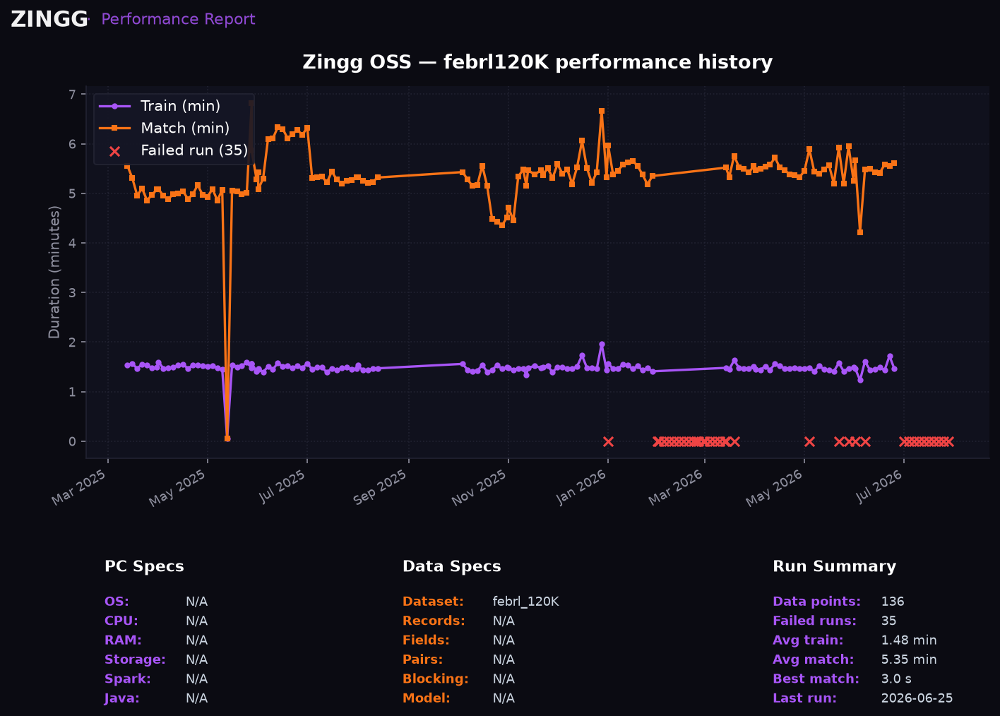
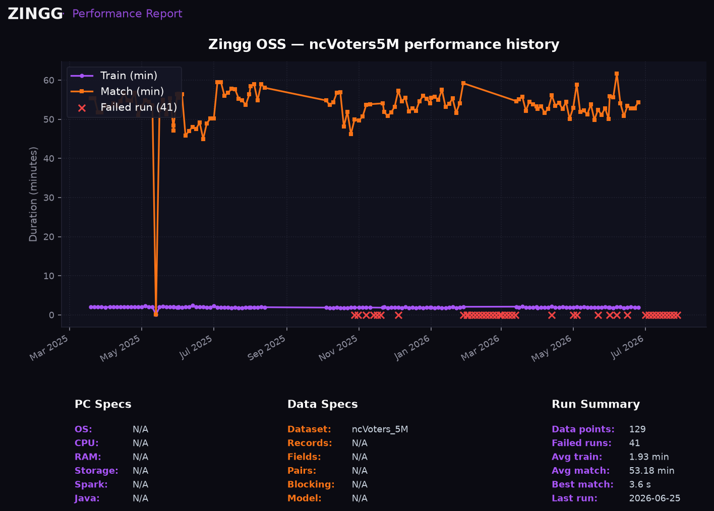

# zingg_performance

Performance is critical for entity resolution, and this repo helps to regularly measure and record the performance of Zingg on different datasets. 

The main script here is perfTestRunner, which takes arguments in the form of json. Example inputs are at [https://github.com/zinggAI/zingg/tree/main/perf_test](https://github.com/zinggAI/zingg/tree/main/perf_test)

The perfTestRunner will run each test defined in the config, and save the runtime to a file location defined in the json.

One chart is produced per dataset:

### febrl 120K

### ncVoters 5M

